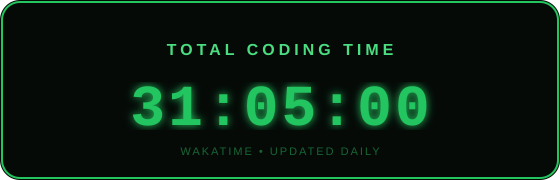

<!-- HEADER BANNER -->

  

<!-- TYPING ANIMATION -->

  

<!-- BADGES ROW -->

  
  
  &nbsp;
  

 

---

<!-- ABOUT ME -->
##  &nbsp;About Me

<table width="100%">
<tr>

<!-- LEFT COLUMN -->
<td width="65%" valign="top">

<pre>
<code>
const abdullah = {
    name: "Abdullah Al Saba",
    role: "MERN Stack Developer",
    education: "B.Sc. in chemistry — Dhaka Central University",
    location: "Bangladesh 🇧🇩",

    stack: {
        frontend: ["React", "Next.js", "Tailwind"],
        backend: ["Node.js", "Express.js", "REST API"],
        database: ["MongoDB"],
        auth: ["BetterAuth", "JWT"]
    },

    currentFocus: ["TypeScript"],
    tools: ["Git", "GitHub", "VS Code"],

    openTo: [
        "Remote Work",
        "Contract",
        "Open Source",
        "Freelance Projects"
    ],

    motto:
        "Build with purpose. Learn without limits. Ship with confidence"
};
</code>
</pre>

</td>

<!-- RIGHT COLUMN -->
<td width="35%" align="center" valign="top">

<!-- DEVELOPER GIF -->

  

<!-- CODING TIMER -->

</td>

</tr>
</table>

 

  Hey, I'm <strong>Abdullah Al Saba</strong> — a self-driven <strong>MERN Stack Developer from Bangladesh</strong> who enjoys building modern, responsive, and user-focused web applications.

  I started with <strong>HTML & CSS</strong>, progressed through <strong>JavaScript, React, and Next.js</strong>, and expanded into full-stack development with <strong>Node.js, Express.js, and MongoDB</strong>. I believe in <strong>learning by building</strong>, so I focus on creating real-world projects, solving practical problems, and continuously improving my development skills.

  My goal: <strong>keep learning, build meaningful products, and grow into a strong full-stack developer who can take ideas from concept to production.</strong>

 

---

<!-- TECH STACK -->

##  &nbsp;Tech Stack

### ⚛️ Frontend

  
  
  
  
  

### 🖥️ Backend & Database

  
  
  
  

### 🔐 Authentication

  
  

### 🛠️ Tools

  
  
  

---

## 🚀 &nbsp;Projects

<table width="100%">
  <tr>
    <td align="center" width="50%">
      <h3>🌐 Portfolio Website</h3>
      

        A personal portfolio website built with HTML, CSS, and JavaScript.
        It showcases my projects, skills, and information through a clean,
        responsive, and user-friendly interface.
      

      
      
      
    </td>
    <td align="center" width="50%">
      <h3>🎓 SkillSphere</h3>
      

        An online learning platform built with Next.js, providing a clean
        and responsive interface for exploring courses and educational content.
      

      
      
    </td>
  </tr>

  <tr>
    <td align="center" width="50%">
      <h3>⚽ SportNest</h3>
      

        A full-stack sports facility booking platform where users can browse,
        book, and manage sports facilities through a modern and responsive interface.
      

      
      
      
    </td>
    <td align="center" width="50%">
     <h3>📚 Fable</h3>

  A full-stack ebook platform built with Next.js, Node.js, Express.js,
  and MongoDB, featuring secure authentication, ebook sharing,
  purchasing, reading, and role-based dashboards.

  </tr>
</table>

---

<!-- GITHUB STATS -->
## 📊 GitHub Stats

  

<!-- ACTIVITY GRAPH -->

  

---

<!-- QUOTE -->
## 💬 &nbsp;Quote I Live By

  

> *"The best way to learn to code is to write code — every single day."*

---

<!-- CONNECT -->
## 🤝 &nbsp;Connect With Me

  &nbsp;
  &nbsp;
  &nbsp;
  

  

